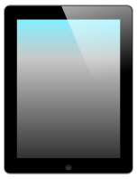
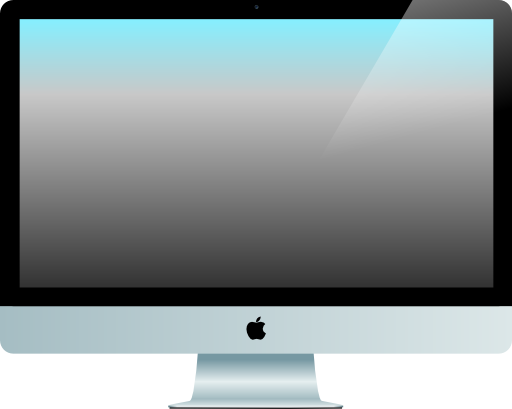

# iReplica

This project aims to be a perfect reproduction of the design of Apple devices 
and their user interfaces in HTML, CSS and SVG.
You can use it for pixel-perfect mock-ups of your next app 
or to study the timeless elegance of Apple's design.





This are the views of iOS 5 on the iPhone in alphabetical order:

```txt
Standby
├── Camera
└── Homescreen
  ├── App Store
  ├── Calculator
  ├── Calendar
  ├── Camera
  ├── Clock
  ├── Compass
  ├── Contacts
  ├── Game Center
  ├── iTunes
  ├── Mail
  ├── Maps
  ├── Messages
  ├── Music
  ├── Newsstand
  ├── Notes
  ├── Notifications
  ├── Phone
  ├── Photos
  ├── Recent Apps
  ├── Reminders
  ├── Safari
  ├── Siri
  ├── Search
  ├── Settings
  ├── Stocks
  ├── Videos
  ├── Voice Memos
  ├── Weather
  └── Youtube
```
